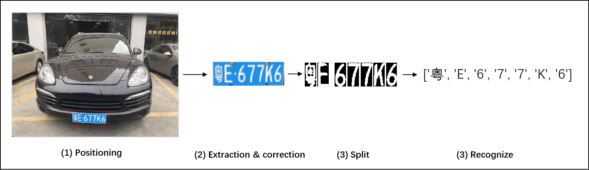
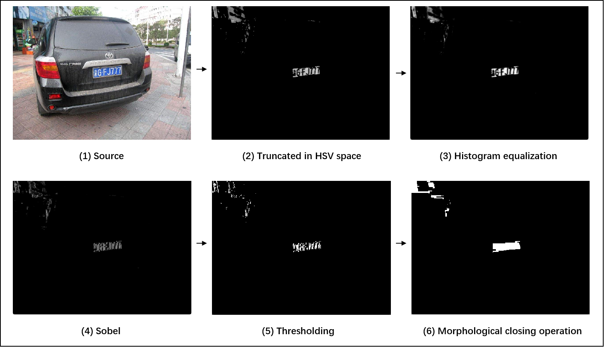
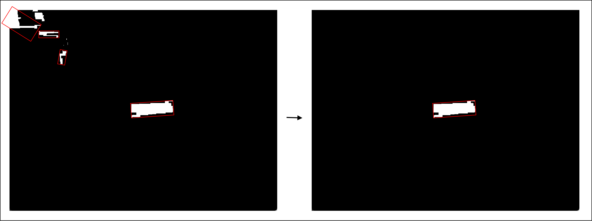
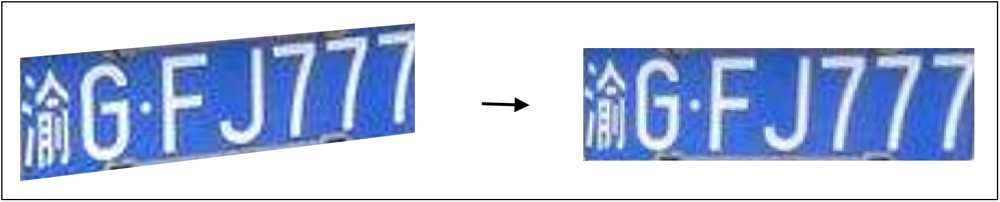
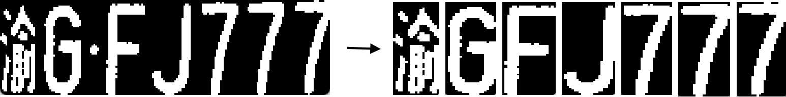
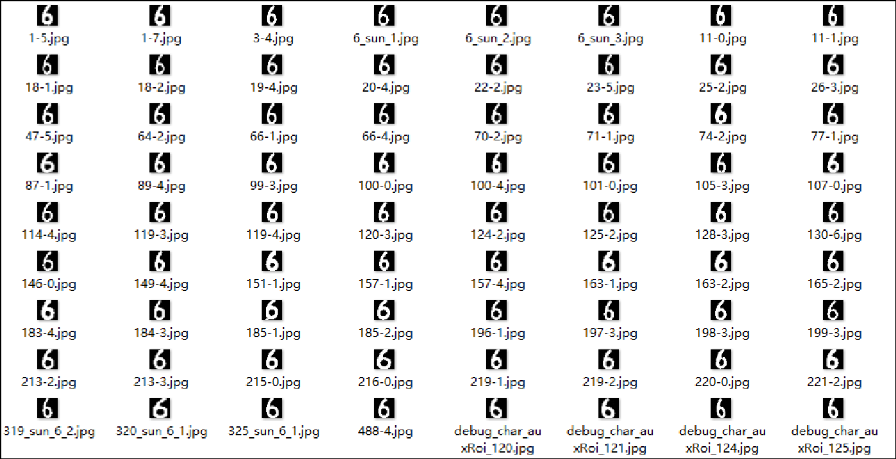

# License plate Recognition algorithm
A license plate recognition algorithm based on OpencV and SVM algorithm.

## 1. Algrithm flow
The algorithm flow is very simple, can be summarized as the following four steps:



## 2. Algorithm details
### 2.1 Preprocess
In order to improve the accuracy of positioning, some Some pre-processing is necessary.


### 2.2 Extract plate
After pre-processing, The license plate area is usually retained in the image. Of course, there are also some other items that we need to exclude.

Because the shape of the license plate is rectangular, we can preliminarily match the license plate by rectangular fitting.



We can simply filter out the vast majority of non-license plate areas from area size, aspect ratio and space ratio. Here, it's better to do a second check with a classifier using machine learning. 

### 2.3 Correct
Usually, the license plate in the image has distortion, which is not conducive to the character recognition. Therefore, we used a perspective transform to correct the license plate to a standard size.



### 2.4 Split
Character recognition is usually carried out word by word, so all characters in the license plate need to be split. Although it is easy to split characters equally spaced, this usually fails when there is a lot of noise. 

Note that there is a space between each character, and the pixel value in the middle is usually small, so we can use a specific algorithm to find the space in the middle to separate the characters.



### 2.4 Recognize
The final step is character recognition, which translates a picture of a single character into text. The algorithm used here is SVM algorithm.

Firstly, tens of thousands of characters are used as the training set, as follows:



The trained model can be directly used to recognize the characters separated from the license plate, so as to realize the purpose of license plate recognition.

## 3 Usage
This project is fully implemented in Python language, using OpencV for image processing and character recognition, requiring little dependence. In addition, the trained SVM model in the project can be used directly without the user's training.
### 3.1 Installing dependency packages
To use this project, you must have Python installed on your computer and install the dependencies using the following command:
```shell
pip3 install -r ./requirements.txt
# Or use domestic sources by
pip3 install -r ./requirements.txt -i https://pypi.tuna.tsinghua.edu.cn/simple
```

### 3.2 Test
It is simple to use, just use the following command in the project root directory:
```shell
python3 ./main.py test.jpg
```